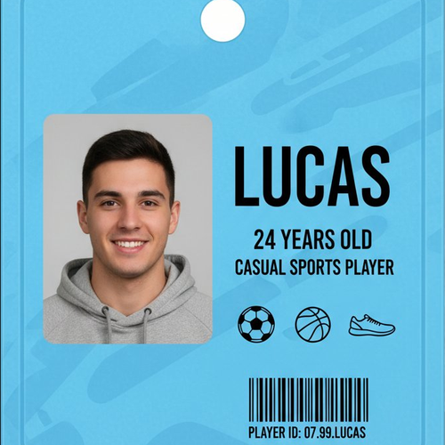
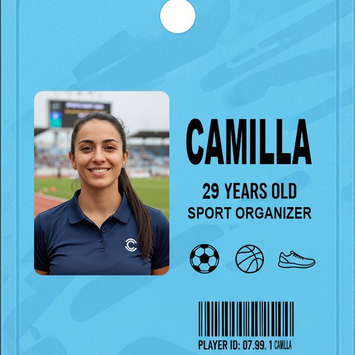
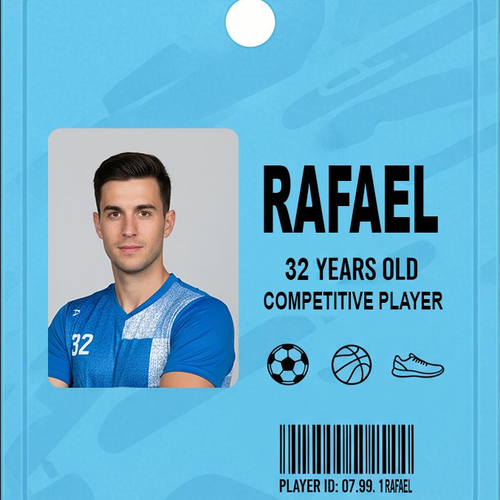
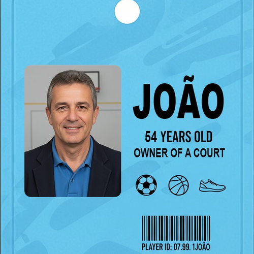
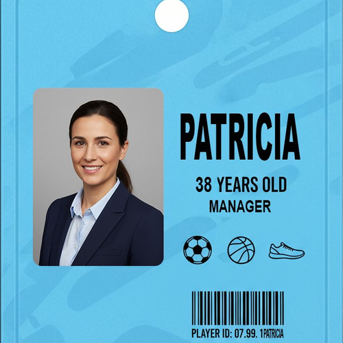
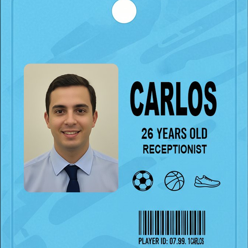

# Especificações do Projeto

**Versão:** 1.0 · **Data:** 10 de agosto de 2026 · **Status:** proposta para validação

Pré-requisitos: <a href="1-Documentação de Contexto.md"> Documentação de Contexto</a>

A TeamUp é uma plataforma web e mobile para jogadores de PC maiores de 18 anos encontrarem pessoas compatíveis para jogar. O produto substitui a busca fragmentada em Discord, redes sociais e chats de jogos por perfis estruturados, recomendações de compatibilidade, match mútuo, chat e organização de partidas.

### Problema sob a perspectiva do usuário

“Quero encontrar rapidamente pessoas confiáveis para jogar comigo, que usem a mesma plataforma, tenham disponibilidade e objetivos parecidos com os meus, sem ter que procurar em vários grupos desorganizados e confusos.”

### Proposta de solução

A pessoa cria um perfil com jogos, elo, estilo, objetivos e horários. A TeamUp calcula e apresenta candidatos compatíveis; quando há interesse mútuo, cria um match e libera a conversa. A pessoa também pode publicar e entrar em partidas agendadas.

### Escopo do MVP

Inclui: cadastro, autenticação, perfil, preferências, recomendações, match, chat entre matches, partidas e denúncia/bloqueio. A versão inicial suporta PC e um catálogo definido de jogos. Torneios, grupos/comunidades persistentes, integração automática com APIs de jogos, voz e monetização ficam fora do MVP.

## Personas
|   | **Persona 1: Lucas – Jogador Casual** |
|---|-------------------------------------------------------------------------------------------------------------------------------------------------------------------------------------------------------------------------------------------------------------------------------------------------------------------------------------------------------------------------------------------------|
| **Foto** |  |
| **Idade** | 24 anos |
| **Ocupação** | Universitário, jogador casual de fim de semana |
| **Localização** | Belo Horizonte – MG |
| **Personalidade** | • Prático e objetivo • Gosta de jogar com amigos • Valoriza rapidez e simplicidade • Não gosta de burocracia |
| **Angústias e Frustrações** | • Demora na confirmação da quadra • Dificuldade para ver horários livres • Já perdeu jogos por falta de organização • Falta de transparência nos horários disponíveis |
| **Motivações** | • Jogar sem complicação • Encontrar quadras rapidamente • Garantir que o jogo aconteça • Evitar perda de tempo |
| **Expectativas** | • Ver horários em tempo real • Reservar em poucos cliques • Receber confirmação imediata • Sistema simples e rápido |

|   | **Persona 2: Camilla – Organizadora do Grupo** |
|---|-------------------------------------------------------------------------------------------------------------------------------------------------------------------------------------------------------------------------------------------------------------------------------------------------------------------------------------------------------------------------------------------------|
| **Foto** |  |
| **Idade** | 29 anos |
| **Ocupação** | Analista administrativa e organizadora de peladas |
| **Localização** | Contagem – MG |
| **Personalidade** | • Organizada • Comunicativa • Gosta de planejar • Responsável pelo grupo |
| **Angústias e Frustrações** | • Dificuldade em cobrar participantes • Falta de confirmação de presença • Atrasos e desorganização • Falta de controle sobre pagamentos |
| **Motivações** | • Facilitar a gestão do grupo • Automatizar cobranças • Evitar confusões • Garantir participação |
| **Expectativas** | • Divisão automática de valores • Envio de convites e lembretes • Controle de presença • Pagamentos integrados |

|   | **Persona 3: Rafael – Jogador Competitivo** |
|---|-------------------------------------------------------------------------------------------------------------------------------------------------------------------------------------------------------------------------------------------------------------------------------------------------------------------------------------------------------------------------------------------------|
| **Foto** |  |
| **Idade** | 32 anos |
| **Ocupação** | Técnico de TI e atleta amador |
| **Localização** | Uberlândia – MG |
| **Personalidade** | • Competitivo • Determinado • Gosta de desafios • Busca novas partidas |
| **Angústias e Frustrações** | • Falta de quadras disponíveis • Dificuldade em encontrar partidas abertas • Pouca visibilidade de jogos |
| **Motivações** | • Jogar mais vezes • Encontrar novos grupos • Melhorar desempenho |
| **Expectativas** | • Notificações de vagas • Lista de partidas abertas • Filtros por esporte e localização |

|   | **Persona 4: João – Dono de Quadra** |
|---|-------------------------------------------------------------------------------------------------------------------------------------------------------------------------------------------------------------------------------------------------------------------------------------------------------------------------------------------------------------------------------------------------|
| **Foto** |  |
| **Idade** | 54 anos |
| **Ocupação** | Proprietário de quadra de bairro |
| **Localização** | Betim – MG |
| **Personalidade** | • Trabalhador • Comunicativo • Preza por organização • Busca modernizar |
| **Angústias e Frustrações** | • Agenda manual confusa • Conflitos de horário • Baixa divulgação • Muitas ligações |
| **Motivações** | • Aumentar reservas • Reduzir erros • Automatizar agendamentos |
| **Expectativas** | • Agenda digital • Confirmação automática • Mais visibilidade |

|   | **Persona 5: Patricia – Gestora de Complexo Esportivo** |
|---|-------------------------------------------------------------------------------------------------------------------------------------------------------------------------------------------------------------------------------------------------------------------------------------------------------------------------------------------------------------------------------------------------|
| **Foto** |  |
| **Idade** | 38 anos |
| **Ocupação** | Gestora de múltiplas quadras esportivas |
| **Localização** | Juiz de Fora – MG |
| **Personalidade** | • Líder • Analítica • Focada em resultados • Organizada |
| **Angústias e Frustrações** | • Controle manual de várias quadras • Falta de relatórios • Pagamentos desorganizados |
| **Motivações** | • Centralizar gestão • Acompanhar ocupação • Reduzir retrabalho |
| **Expectativas** | • Dashboard completo • Relatórios financeiros • Gestão integrada |

|   | **Persona 6: Carlos – Funcionário da Recepção** |
|---|-------------------------------------------------------------------------------------------------------------------------------------------------------------------------------------------------------------------------------------------------------------------------------------------------------------------------------------------------------------------------------------------------|
| **Foto** |  |
| **Idade** | 26 anos |
| **Ocupação** | Atendente de quadra esportiva |
| **Localização** | Ribeirão das Neves – MG |
| **Personalidade** | • Atencioso • Ágil • Comunicativo • Resolve rápido |
| **Angústias e Frustrações** | • Filas e atrasos • Agenda desatualizada • Retrabalho constante |
| **Motivações** | • Agilizar atendimento • Reduzir erros • Melhorar experiência |
| **Expectativas** | • Check-in digital • Confirmação rápida • Agenda clara |

## Histórias de Usuários

Com base na análise das personas forma identificadas as seguintes histórias de usuários:

|EU COMO... `PERSONA`| QUERO/PRECISO ... `FUNCIONALIDADE` |PARA ... `MOTIVO/VALOR`                 |
|--------------------|------------------------------------|----------------------------------------|
| Lucas | Criar uma conta usando e-mail e senha. | Acessar a plataforma ver horários disponíveis e reservar rapidamente. | Garantir que eu consiga jogar sem complicação e sem perder tempo. |
| Camila | Enviar convites, confirmar presença e dividir valores automaticamente. | Facilitar a organização dos jogos e evitar confusões com pagamentos.|
| Rafael | Encontrar partidas abertas e receber alertas de vagas. | Jogar mais vezes e participar de jogos desafiadores. |
| João | Uma agenda digital clara e automatizada. | Evitar conflitos de horário e aumentar a ocupação da quadra. |
| Patricia | Relatórios de ocupação e receita, e controle centralizado. | Tomar decisões estratégicas e reduzir retrabalho. |
| Carlos | Fazer check-in digital e visualizar reservas do dia. | Agilizar o atendimento e evitar erros operacionais. |
| Gabriel  | Acompanhar indicadores gerais do negócio e resultados estratégicos. | Tomar decisões de alto nível e garantir o crescimento sustentável da empresa. | 
| Fernanda  | Monitorar desempenho da equipe e acompanhar processos internos. | Garantir eficiência, reduzir falhas e melhorar a produtividade. |
| Thiago | Acessar documentação clara e requisitos bem definidos. | Implementar funcionalidades corretamente e evitar retrabalho. |
| Marina  | Acessar dados de uso e comportamento dos usuários. | Criar campanhas mais eficazes e aumentar a adesão ao sistema. |
| Rodrigo  | Ter informações claras sobre planos, preços e benefícios. | Apresentar o produto com segurança e fechar mais vendas. |
| Beatriz | Acessar relatórios de faturamento, custos e fluxo de caixa. | Controlar a saúde financeira e apoiar decisões estratégicas. |

## Modelagem do Processo de Negócio 

### Análise da Situação Atual

Apresente aqui os problemas existentes que viabilizam sua proposta. Apresente o modelo do sistema como ele funciona hoje. Caso sua proposta seja inovadora e não existam processos claramente definidos, apresente como as tarefas que o seu sistema pretende implementar são executadas atualmente, mesmo que não se utilize tecnologia computacional. 

### Descrição Geral da Proposta

Apresente aqui uma descrição da sua proposta abordando seus limites e suas ligações com as estratégias e objetivos do negócio. Apresente aqui as oportunidades de melhorias.

### BPMN 1 – Processo atual sem App

### BPMN 2 – Com o app FairPlay

## Indicadores de Desempenho

 ### Dashboard

### Gráficos

Feitos no Excel:
https://sgapucminasbr-my.sharepoint.com/personal/1596849_sga_pucminas_br/_layouts/15/guestaccess.aspx?share=IQAtNptNGlgyT5L_BnQhaW7zAawQZr3OI8-bM31bxzRV9pA&e=MsYFPC 

## Requisitos

As tabelas que se seguem apresentam os requisitos funcionais e não funcionais que detalham o escopo do projeto. Para determinar a prioridade de requisitos, aplicar uma técnica de priorização de requisitos e detalhar como a técnica foi aplicada.

### Requisitos Funcionais

|ID    | Descrição do Requisito  | Prioridade |
|------|-----------------------------------------|----|
|RF-001|O sistema deve permitir que usuário se cadastre informando nome, CPF, telefone, email e senha. | ALTA | 
|RF-002|O sistema deve solicitar uma foto em tempo real do rosto para oficializar o cadastro na aplicação.| ALTA |
|RF-003|O sistema deve permitir que usuários e empresas realizem login com credenciais válidas.| ALTA |
|RF-004|O sistema deve permitir que o usuário visualize e edite seus dados de perfil.| BAIXA |
|RF-005|O sistema deve permitir que o usuário faça reservas e cancelamentos.| ALTA |
|RF-006|O sistema deve permitir que o usuário faça pagamento.| ALTA |
|RF-007|O sistema deve permitir que empresas se cadastrem e criem seu perfil (nome, CNPJ, contato e localização).| ALTA |
|RF-008|O sistema deve permitir que a empresa visualize e edite seus dados de perfil.| MÉDIA |
|RF-009|O sistema deve permitir que a empresa cadastre o espaço para a prática dos esportes (ex: Quadras e Campos).| ALTA |
|RF-010|O sistema deve permitir que a empresa visualize, edite e exclua quadras.| MÉDIA |
|RF-011|O sistema deve permitir que a empresa faça cancelamento de reservas.| ALTA |
|RF-012|O sistema deve permitir que a empresa integre seus sistema de pagamento (como um pagseguro por exemplo).| ALTA |
|RF-013|O sistema deve permitir que a empresa define dias e horários disponíveis para cada quadra.| ALTA |
|RF-014|O sistema deve permitir que usuários pesquisem quadras por localização, tipo de esporte e preço.| ALTA |
|RF-015|O sistema deve exibir os horários disponíveis e ocupados de uma quadra por dia/semana.| MÉDIA |
|RF-016|O sistema deve impedir reservas em horários já ocupados na mesma quadra.| ALTA |
|RF-017|O sistema deve permitir registrar pagamento (ex.: Pix/cartão) e associar à reserva.| ALTA |
|RF-018|O sistema deve impedir que um usuário banido crie uma nova conta com o mesmo e-mail e CPF.| MÉDIA |
|RF-019|O sistema deve permitir que os usuários avaliem quadras e empresas com notas.| BAIXA |
|RF-020|O sistema deve permitir que usuário localize esporte pelo tipo e tente fechar um horário e data com outros usuários aleatórios.| MÉDIA |
|RF-021|O sistema deve permitir a exportação de agendamentos para calendários externos (Google Calendar, iCal, Outlook) via padrão .ics ou integração via API.| BAIXA |
|RF-022|O sistema deve notificar usuário e empresa quanto a reservas e pagamentos.| MÉDIA |
|RF-023|O sistema deve permitir que o usuário solicite um dia e horário para ser mensalista.| ALTA |
|RF-024|O sistema deve retornar aprovação ou não do dia e horário para ser mensal da empresa para usuário, autorizado, não autorizado ou trazendo os dias e horários.| ALTA |
|RF-025|O sistema deve permitir que a empresa bloqueie datas e horários determinados.| ALTA |
|RF-026|O sistema deve solicitar número de jogadores no ato da reserva.| BAIXA |
|RF-027|O sistema deve limitar a quantidade de reservas que o usuário pode realizar no mesmo dia.| MÉDIA |
|RF-028|A reserva pode ser feita 7 dias antes com data e horário marcado;  Pode ser cancelada em até 24Hrs antes da data e horário marcados.| ALTA |
|RF-029|A reserva pode ser feita, concluída e paga até 10 minutos antes do horário combinado.| ALTA |

### Requisitos não Funcionais

|ID     | Descrição do Requisito  |Prioridade |
|-------|-------------------------|----|
|RNF-001|O sistema deve ser intuitivo, permitindo que um usuário realize uma reserva em até 3 minutos. | BAIXA | 
|RNF-002|O sistema deve responder às principais ações (listar horários, reservar, pagar) em até 3 segundos em condições normais.|  BAIXA | 
|RNF-003|O sistema deve estar disponível 24/7, exceto em janelas de manutenção programada.| ALTA |
|RNF-004|O sistema deve proteger contas com senha segura (hash + salt) e permitir recuperação de acesso.| ALTA | 
|RNF-005|O sistema deve armazenar e processar dados pessoais para segurança (mínimo necessário + consentimento).| MÉDIA |
|RNF-006|O sistema deve garantir consistência das reservas, evitando duplicidade e conflito na concorrência.| ALTA |
|RNF-007|O sistema deve funcionar em navegadores modernos e ser responsivo para celulares e tablets.| ALTA | 
|RNF-008|O sistema deve suportar crescimento de usuários/quadras sem degradação significativa.| ALTA | 
|RNF-009|O sistema deve possuir código modular e documentação mínima (README + endpoints), facilitando a manutenção.| ALTA | 
|RNF-010|O sistema deve ter acesibilidade e suporte a navegação básica para usuários e suas limitações.| MÉDIA | 
|RNF-011|O sistema deve realizar backups periódicos e permitir restauração em caso de falha.| ALTA |
|RNF-012|O sistema deve exigir que a senha tenha no mínimo 8 caracteres, incluindo letras, números e caracteres especiais.| BAIXA | 
|RNF-013|A aplicação deve manter uma identidade visual consistente em todas as páginas, considerando a paleta de cores, a tipografia e o layout.| MÉDIA | 
|RNF-014|O sistema deve garantir que notificações críticas (confirmação e cancelamento) sejam enviadas com uma taxa de entrega de 99% em até 2 minutos após o evento gerador.| ALTA | 
|RNF-015|O sistema deve garantir a reserva temporária de um horário selecionado por no máximo 10 minutos durante o processo de checkout, liberando-o automaticamente caso o pagamento não seja confirmado.| BAIXA |
|RNF-016|O sistema deve garantir que, no ato do cadastro, o usuário aceite um Termo de Utilização e a empresa aceite o termo de responsabilidade.| ALTA |
|RNF-017|O sistema deve ter número mínimo de jogadores para fechamento de datas e horário em relação ao esporte escolhido.| MÉDIA | 

## Restrições

O projeto está restrito pelos itens apresentados nas tabelas a seguir.

| ID | Restrições de Gestão                                                                                                                                                                                                                     |
| -- | ---------------------------------------------------------------------------------------------------------------------------------------------------------------------------------------------------------------------------------------- |
| 01 | O projeto deverá ser desenvolvido e entregue até o final do semestre letivo, respeitando os prazos definidos pela disciplina e pelo cronograma acadêmico.                                                                                |
| 02 | O projeto deverá ser desenvolvido utilizando ferramentas, tecnologias e softwares gratuitos ou que possuam licenças acadêmicas, garantindo que todos os membros da equipe tenham acesso aos recursos necessários.                        |
| 03 | O desenvolvimento do projeto deverá seguir uma metodologia ágil, com reuniões periódicas de acompanhamento entre os membros da equipe, visando monitorar o progresso das atividades e garantir o cumprimento do cronograma estabelecido. |
| 04 | Todas as atividades do projeto deverão ser documentadas adequadamente, incluindo requisitos, diagramas, decisões de projeto e demais artefatos necessários para a compreensão e manutenção do sistema.                                   |
| 05 | O projeto deverá ser desenvolvido em equipe, com divisão clara de responsabilidades entre os membros, garantindo a colaboração e a participação de todos durante o processo de desenvolvimento.                                          |
| 06 | As decisões relacionadas ao escopo, funcionalidades e alterações relevantes no projeto deverão ser discutidas e aprovadas pelo grupo antes de sua implementação.                                                                         |

| ID | Restrições de Negócio                                                                                                                                                                                                                     |
| -- | ---------------------------------------------------------------------------------------------------------------------------------------------------------------------------------------------------------------------------------------- |
| 01 | O sistema deverá permitir a realização de reservas apenas dentro dos horários de funcionamento definidos pela empresa administradora da quadra.                                                                                |
| 02 | Cada horário disponível poderá ser reservado por apenas um usuário ou grupo por vez, evitando conflitos de agendamento.                        |
| 03 | O desenvolvimento do projeto deverá seguir uma metodologia ágil, com reuniões periódicas de acompanhamento entre os membros da equipe, visando monitorar o progresso das atividades e garantir o cumprimento do cronograma estabelecido. |
| 04 | O cancelamento de reservas deverá seguir as regras definidas pela empresa administradora, podendo haver limites de tempo para cancelamento sem penalidades.                                 |
| 05 | O sistema deverá registrar todas as reservas realizadas, permitindo o controle e histórico de utilização das quadras.  |
| 06 | O pagamento das reservas poderá ser realizado por meios definidos pela empresa, como Pix, cartão ou pagamento presencial no local.                                                                         |
| 07 | A responsabilidade pela segurança física do ambiente esportivo e pela manutenção das quadras é exclusivamente da empresa administradora, não sendo responsabilidade do sistema.      |
| 08 | Os administradores deverão possuir permissões especiais no sistema para cadastrar, editar ou remover quadras e horários disponíveis.      |

## Diagrama de Casos de Uso

> **Links Úteis**:
> - [Criando Casos de Uso]([https://www.ibm.com/docs/pt-br/elm/6.0?topic=requirements-creating-use-cases](https://lucid.app/lucidchart/b3bc78c2-3ccd-455d-91ed-86c4f5b0aabc/edit?invitationId=inv_8253ba6e-fafb-4b5d-89f0-8a01d9dee1ac&page=0_0#)

# Matriz de Rastreabilidade

Cruzado entre Product Owner, Product Manager, Requisitos Funcionais e Requisitos Não Funcionais.

> **Links Úteis**:
> - [Matriz - Rastreabilidade](https://docs.google.com/spreadsheets/d/1C4A2cVXVXwLHyOIN7LM2g5ma48oLScUoOhXD7nikhKQ/edit?gid=0#gid=0)

# Gerenciamento de Projeto

De acordo com o PMBoK v6 as dez áreas que constituem os pilares para gerenciar projetos, e que caracterizam a multidisciplinaridade envolvida, são: Integração, Escopo, Cronograma (Tempo), Custos, Qualidade, Recursos, Comunicações, Riscos, Aquisições, Partes Interessadas. Para desenvolver projetos um profissional deve se preocupar em gerenciar todas essas dez áreas. Elas se complementam e se relacionam, de tal forma que não se deve apenas examinar uma área de forma estanque. É preciso considerar, por exemplo, que as áreas de Escopo, Cronograma e Custos estão muito relacionadas. Assim, se eu amplio o escopo de um projeto eu posso afetar seu cronograma e seus custos.

## Gerenciamento de Tempo

Com diagramas bem organizados que permitem gerenciar o tempo nos projetos, o gerente de projetos agenda e coordena tarefas dentro de um projeto para estimar o tempo necessário de conclusão.

O gráfico de Gantt ou diagrama de Gantt também é uma ferramenta visual utilizada para controlar e gerenciar o cronograma de atividades de um projeto. Com ele, é possível listar tudo que precisa ser feito para colocar o projeto em prática, dividir em atividades e estimar o tempo necessário para executá-las.

## Gerenciamento de Equipe

# Cronograma do Projeto

O desenvolvimento do FairPlay está organizado em cinco fases evolutivas, seguindo uma abordagem incremental, com entregas progressivas até a consolidação da versão final do produto.

---

## Fase 1 – Definição Estratégica e Planejamento  
**Período:** 09/02/2026 a 08/03/2026  

### Entregas:
- Documento de Contexto do Produto  
- Especificação do Problema  

**Objetivo:**  
Definir o posicionamento do FairPlay, identificar o problema central a ser resolvido e estabelecer as bases estratégicas do projeto.

---

## Fase 2 – Estruturação da Solução  
**Período:** 09/03/2026 a 05/04/2026  

### Entregas:
- Definição da metodologia de desenvolvimento  
- Arquitetura da solução  
- Projeto de interface (UI)  
- Implementação inicial das funcionalidades principais  
- Definição de indicadores de desempenho  

**Objetivo:**  
Estruturar tecnicamente o sistema e iniciar a construção da primeira versão funcional.

---

## Fase 3 – Expansão e Validação  
**Período:** 06/04/2026 a 10/05/2026  

### Entregas:
- Evolução das funcionalidades  
- Plano de testes funcionais  
- Plano de testes de usabilidade  
- Registro e análise dos testes realizados  

**Objetivo:**  
Ampliar as funcionalidades do FairPlay e validar seu desempenho e experiência de uso.

---

## Fase 4 – Consolidação e Estabilização  
**Período:** 11/05/2026 a 31/05/2026  

### Entregas:
- Refinamento das funcionalidades  
- Correções e melhorias  
- Atualização dos registros de testes  
- Preparação da versão estável do sistema  

**Objetivo:**  
Garantir qualidade, estabilidade e consistência antes da entrega final.

---

## Fase 5 – Finalização e Apresentação  
**Período:** 01/06/2026 a 21/06/2026  

### Entregas:
- Consolidação da versão final  
- Documentação final  
- Apresentação oficial do projeto  

**Objetivo:**  
Formalizar a conclusão do desenvolvimento do FairPlay e apresentar os resultados obtidos.

## Gestão de Orçamento

O processo de determinar o orçamento do projeto é uma tarefa que depende, além dos produtos (saídas) dos processos anteriores do gerenciamento de custos, também de produtos oferecidos por outros processos de gerenciamento, como o escopo e o tempo.

